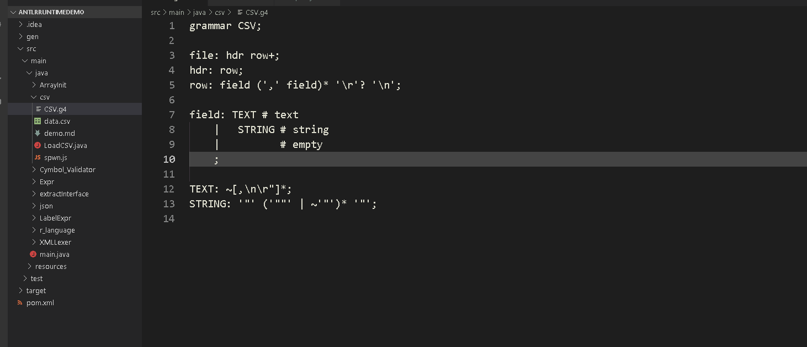
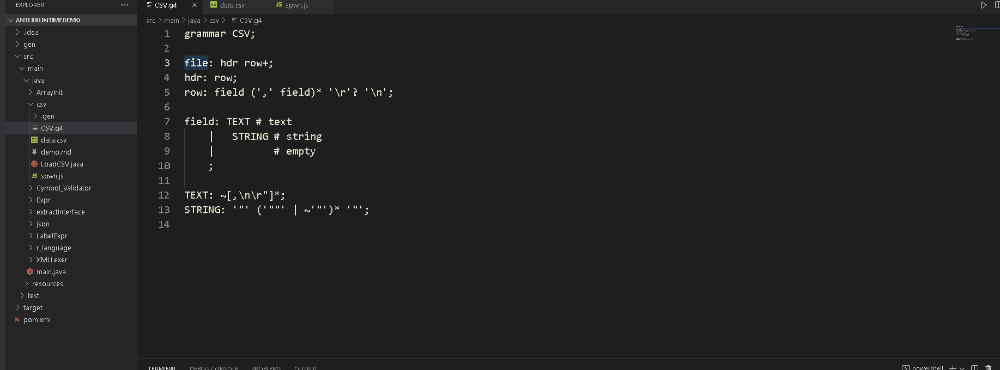
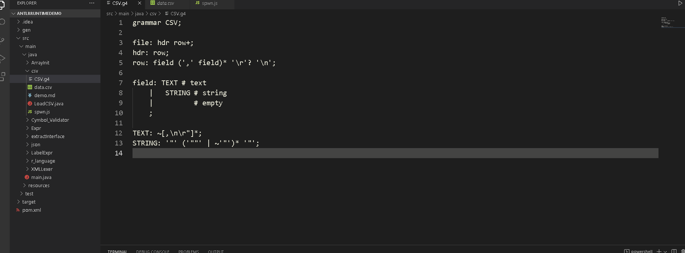

# JustAntlr

*A vscode plugin make antlr easy*

## Feature

1. generate antlr files with grammar file

2. make the generation of AST gui tree easy

3. interact with grammar

## Prerequisite

The installment of Jdk is necessary. Its version is at least 1.7+.

## Usage

### Generate Antlr Files with Grammar File

Open a grammar file, g or g4 file. Enter `ctrl + shift + p`, select `justAntlr: build`. Follow the intruction and input the information, the files are generated automatically.

*The following usage is only available in windows for now*

### Generation of AST Gui Tree

JustAntlr supports the generation of AST gui tree. you just open a grammar file and select a rule. Right click and choose `justAntlr: generate AST gui`.

### Interact with Grammar

It is possible to interact with grammar. Open a grammar file and select a rule. Right click `justAntlr: interactive input`. Vscode opens a web view where you can input text and find the result.

## Issues

Submit the issues if you find any bug or have any suggestion.

## Contribution

Fork the repo and submit pull requests.